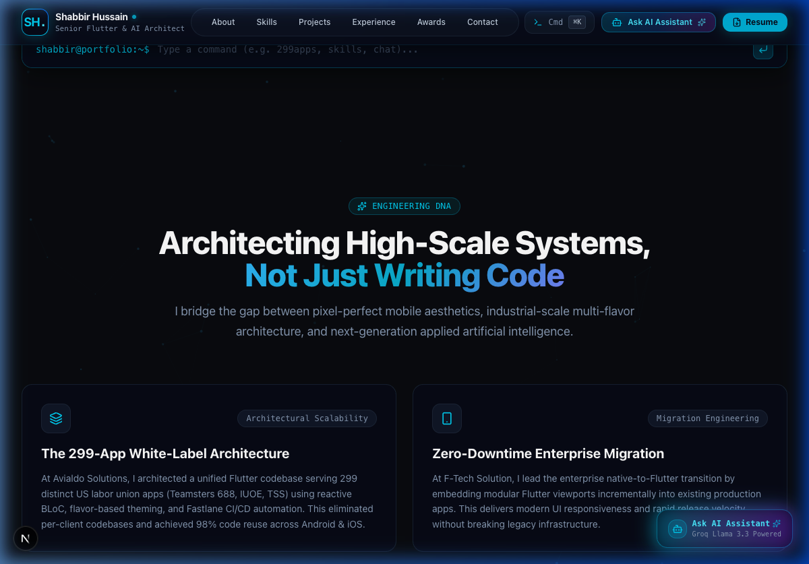
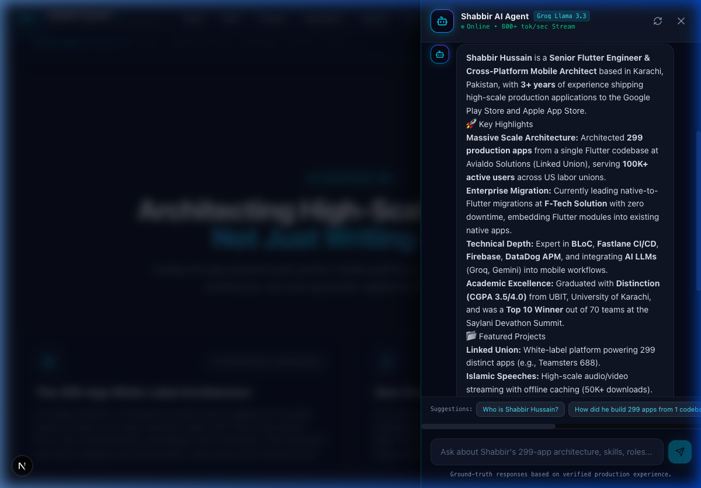

# ⚡ Shabbir Hussain — AI-Powered Mobile Architect Portfolio

> **Senior Flutter Engineer & Cross-Platform Mobile Architect**  
> Architected high-scale ecosystems (299+ production apps from 1 codebase) & applied AI systems.  
> 🌐 **Live Portfolio:** [https://shabbirhussain.vercel.app](https://shabbirhussain.vercel.app)

---

## 🌟 Highlights & Key Differentiators

- **299+ Production Apps from 1 Codebase**: Architected the multi-flavor white-label platform for *Linked Union* (Avialdo Solutions) using BLoC & Fastlane CI/CD automation.
- **Enterprise Native-to-Flutter Migration**: Leading seamless module migrations at *F-Tech Solution* with zero downtime.
- **Integrated Ultra-Fast AI Digital Representative**: Streaming AI persona powered by Groq LLM inference (`qwen3.8-27b` / `llama-3.3-70b`) responding at 800+ tokens/second.
- **Interactive Developer Experience**: Integrated interactive terminal (CLI), `Cmd+K` command palette, certificate lightbox zoom, celebration confetti on resume download, and glassmorphic micro-interactions.
- **Academic Distinction**: BS in Software Engineering from UBIT, University of Karachi (Distinction, CGPA 3.5/4.0) & Saylani Devathon Summit 1.0 Winner (Top 10 of 70 teams).

---

## 📸 Screenshots

| Homepage & Constellation Effect | AI Assistant Panel |
| :---: | :---: |
|  |  |

---

## 🛠️ Technology Stack

| Layer | Technologies |
|---|---|
| **Framework** | Next.js 15 (App Router), React 19, TypeScript |
| **Styling & UI** | Tailwind CSS v4, Custom Cyber Glassmorphism, Neon Glow Utilities |
| **Motion & Canvas** | Framer Motion (Motion), HTML5 Canvas Constellation Particle System, Canvas Confetti |
| **AI Layer** | Groq SDK (`groq-sdk`), Google Generative AI (`@google/generative-ai`), SSE Streaming |
| **Icons & Typography** | Lucide React, Custom Vector SVGs, Geist / Inter typography |
| **Deployment** | Vercel Edge Serverless Architecture (100% Free Tier) |

---

## 🚀 Quick Start (Local Development)

### 1. Clone or Open the Repository
```bash
cd /Users/macminim2/.gemini/antigravity/scratch/portfolio
```

### 2. Install Dependencies
```bash
npm install
```

### 3. Configure Environment Variables
Create a `.env.local` file in the root directory:
```env
# Groq API Key (Free tier at https://console.groq.com/keys)
GROQ_API_KEY=your_groq_api_key_here

# Optional Gemini API Key fallback (Free at https://aistudio.google.com/app/apikey)
GEMINI_API_KEY=your_gemini_key_here

# Site URL for canonical OpenGraph tags
NEXT_PUBLIC_SITE_URL=https://shabbirhussain.vercel.app
```

### 4. Run Development Server
```bash
npm run dev
```
Open [http://localhost:3000](http://localhost:3000) in your browser.

---

## 📦 How to Update Portfolio Content & AI Knowledge

All portfolio content and AI knowledge are decoupled from the UI:

1. **Portfolio Information & Projects**:
   - Edit [`src/data/portfolio.ts`](src/data/portfolio.ts) to update personal bio, projects, metrics, skills, job history, and certificates.
2. **AI Assistant Directives & Knowledge**:
   - Edit [`src/data/knowledge.ts`](src/data/knowledge.ts) to add or modify rules, career highlights, and Q&A context for the AI representative.
3. **Assets & Screenshots**:
   - Place images in `public/assets/projects/`, `public/assets/profile/`, or `public/assets/certificates/`.

---

## 🌐 Deploying to Vercel (100% Free Forever)

1. Push your repository to GitHub:
   ```bash
   git add .
   git commit -m "feat: complete AI-powered portfolio website"
   git branch -M main
   git remote add origin https://github.com/1shabbirhussain/<your-repo-name>.git
   git push -u origin main
   ```
2. Go to [Vercel Dashboard](https://vercel.com/new).
3. Import your GitHub repository.
4. Under **Environment Variables**, add:
   - `GROQ_API_KEY` = `your_groq_api_key_here`
   - `NEXT_PUBLIC_SITE_URL` = `https://shabbirhussain.vercel.app`
5. Click **Deploy**. Vercel will build and deploy your site in ~30 seconds.

---

## 📬 Contact & Connect

- **Email**: [001.shabbirhussain@gmail.com](mailto:001.shabbirhussain@gmail.com)
- **WhatsApp / Phone**: [+92-347-8356631](https://wa.me/923478356631)
- **LinkedIn**: [linkedin.com/in/shabbir-hussain-445338228](https://www.linkedin.com/in/shabbir-hussain-445338228)
- **GitHub**: [github.com/1shabbirhussain](https://github.com/1shabbirhussain)

---

*© 2026 Shabbir Hussain. Built with Next.js 15, Framer Motion, and Groq AI.*
